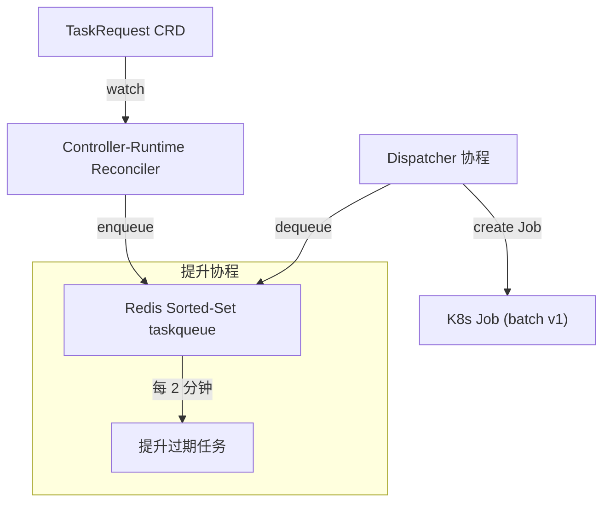

# 优先级队列控制器（单二进制原型）设计文档

## 1 目标与范围
一个 **轻量级、单可执行文件** 的原型，演示如何将自定义 `TaskRequest` CRD 按 *优先级* 转化为 Kubernetes `Job`，并通过“提升机制”避免低优先级任务饥饿。生产环境部署应拆分关注点到独立包，并补充完整的错误处理、指标与 Leader 选举。

---
## 2 关键组件与流程

1. **TaskRequestReconciler** – 监听 `TaskRequest` 新增/变更，仅入队一次（用注解防重）。
2. **RedisPriorityQueue** – 通过 `score = priority×1e12 + timestamp` 排序，同优先级内 FIFO。后台定时器将等待超过 `promoteDur` 的任务 *降分*（即提优先级）。
3. **Dispatcher** – 持续弹出最高优先级任务，创建带 `priorityClassName` 的 Kubernetes **Job**。

---
## 3 数据结构
### 3.1 TaskRequest CRD
| 字段 | 类型 | 说明 |
|------|------|------|
| **metadata.name / .namespace** | string | 对象标识 |
| **spec.priority** | int | 0 (最高) … 5 (最低) |
| **spec.payload** | map | 任意键值对（如 `image`） |

### 3.2 Redis ZSET 成员编码
```
<namespace>/<name>          # 例：default/build-42
score = priority*1e12 + epochNano
```

---
## 4 输入与输出
| 阶段 | 输入 | 输出 |
|------|------|------|
| **Reconciler** | `TaskRequest` 事件 | Redis ZADD |
| **Queue** | Enqueue/Dequeue 调用 | 成员 ID (`namespace/name`) |
| **Dispatcher** | 队列 ID + TaskRequest | 在同命名空间创建 `Job` |
| **Cluster** | Job 根据 payload.image 运行 | Pod 完成 / 失败状态 |

---
## 5 优先级处理
| spec.priority | PriorityClassName | 说明 |
|---------------|-------------------|------|
| 0‑1 | `pq-high` | 紧急，可抢占 |
| 2 | `pq-default` | 常规负载 |
| 3‑5 | `pq-low` | 尽力而为 |

**提升机制**：当任务等待时间 > `promoteDur`（默认 2 分钟）时，其分数减 `1e12`，每周期向上提升一级直至调度。

---
## 6 配置
| 变量 | 默认值 | 含义 |
|------|--------|------|
| `REDIS_ADDR` | `redis:6379` | Redis 端点 |
| `promoteDur` | `2m` | 提升间隔 |

---
## 7 扩展与加固（TODO）
* 拆分为 **api**、**controller**、**queue**、**scheduler** 等包。
* 提供 RBAC、CRD YAML、Helm/Kustomize 模板。
* Job 创建失败的重试及回退。
* 暴露 Prometheus 指标（入队率、队列长度、提升次数）。
* 高可用 Leader 选举。
* 通过 ConfigMap 使 `priorityClassName` 与提升策略可配置。

---
## 8 新开发者快速上手
1. `kubectl apply -f crd.yaml` – 安装 TaskRequest CRD  
2. 部署 Redis：`helm install redis bitnami/redis`  
3. `make docker-push && kubectl apply -f deploy.yaml` – 运行控制器  
4. 创建示例 TaskRequest：  
   ```yaml
   apiVersion: scheduler.rcme.ai/v1alpha1
   kind: TaskRequest
   metadata:
     name: build-42
   spec:
     priority: 2
     payload:
       image: alpine:3
       cmd: echo hello world
   ```  
5. 观察在同命名空间生成的 Job 与 Pod。

## 9 新增加了测试代码跑demo _test.go文件

```bash
go test -v ./...

```
你应该看到以下三个测试项全部通过：

    TestPriorityAndFIFO
    验证：

        按优先级（Priority 值）严格出队，小值优先

        同一优先级任务按 FIFO（先进先出）顺序出队

    TestPromotion
    使用短的 promotion 间隔，确认：

        低优先级任务在 Redis 中的 score 会定期减少（实际把它“提级”）

        提升后，老的低优先级任务会先于后入队的同级任务出队

    TestDynamicEnqueuePreemption
    验证在以下场景下出队顺序正确：

        先入队一个低优先级任务

        再入队一个更高优先级任务
        …结果应当是后入队的高优先级任务先于先入队的低优先级任务出队。


 

---  

## API Reference

### CustomResourceDefinition

```yaml
apiVersion: apiextensions.k8s.io/v1
kind: CustomResourceDefinition
metadata:
  name: taskrequests.scheduler.rcme.ai
spec:
  group: scheduler.rcme.ai
  versions:
    - name: v1alpha1
      served: true
      storage: true
      schema:
        openAPIV3Schema:
          type: object
          properties:
            spec:
              type: object
              properties:
                priority:
                  type: integer
                payload:
                  type: object
  scope: Namespaced
  names:
    plural: taskrequests
    singular: taskrequest
    kind: TaskRequest
```  
> 该 CRD 定义了 `scheduler.rcme.ai/v1alpha1` 组下的 `TaskRequest` 资源。

### Go 类型定义

```go
// GroupVersion, Scheme
const (
  Group   = "scheduler.rcme.ai"
  Version = "v1alpha1"
)
var SchemeGroupVersion = schema.GroupVersion{Group: Group, Version: Version}

// TaskRequestSpec 定义
type TaskRequestSpec struct {
  // Priority 数字越小优先级越高
  Priority int               `json:"priority"`
  // Payload 任意键值对载荷
  Payload  map[string]string `json:"payload"`
}

// TaskRequest 资源主体
type TaskRequest struct {
  metav1.TypeMeta   `json:",inline"`
  metav1.ObjectMeta `json:"metadata,omitempty"`

  Spec   TaskRequestSpec   `json:"spec,omitempty"`
  Status TaskRequestStatus `json:"status,omitempty"`
}

// TaskRequestStatus 暂无额外字段，可在未来扩展
type TaskRequestStatus struct {
  // Fill in once you need status fields
}

// TaskRequestList 列表类型
type TaskRequestList struct {
  metav1.TypeMeta `json:",inline"`
  metav1.ListMeta `json:"metadata,omitempty"`
  Items           []TaskRequest `json:"items"`
}
```  
> Go 源码见 `pkg/api/v1alpha1/taskrequest_types.go`。

---

## 配置示例

推荐使用 Kustomize 快速部署：

```yaml
# config/kustomization.yaml
resources:
  - crd/bases/scheduler.rcme.ai_taskrequests.yaml
  - rbac/service_account.yaml
  - rbac/role.yaml
  - rbac/role_binding.yaml
  - manager/manager.yaml
```  

### ServiceAccount

```yaml
apiVersion: v1
kind: ServiceAccount
metadata:
  name: taskrequest-sa
  namespace: system
```  

### RBAC 权限

```yaml
# Role: 允许读取和更新 CRD，以及管理 Pods/Jobs
apiVersion: rbac.authorization.k8s.io/v1
kind: Role
metadata:
  name: taskrequest-controller
  namespace: system
rules:
- apiGroups: ["scheduler.rcme.ai"]
  resources: ["taskrequests", "taskrequests/status"]
  verbs: ["get","list","watch","update"]
- apiGroups: [""]
  resources: ["pods","jobs"]
  verbs: ["create","get","list","watch","delete"]
```  
fileciteturn0file3

```yaml
# RoleBinding: 将 Role 绑定到 ServiceAccount
apiVersion: rbac.authorization.k8s.io/v1
kind: RoleBinding
metadata:
  name: taskrequest-controller-binding
  namespace: system
subjects:
- kind: ServiceAccount
  name: taskrequest-sa
  namespace: system
roleRef:
  kind: Role
  name: taskrequest-controller
  apiGroup: rbac.authorization.k8s.io
```  


### Controller Deployment

```yaml
apiVersion: apps/v1
kind: Deployment
metadata:
  name: taskrequest-controller
  namespace: system
spec:
  replicas: 1
  selector:
    matchLabels:
      control-plane: controller-manager
  template:
    metadata:
      labels:
        control-plane: controller-manager
    spec:
      serviceAccountName: taskrequest-sa
      containers:
      - name: manager
        image: your-registry/taskrequest-controller:latest
        command:
        - /manager
        args:
        - "--metrics-addr=0"
        - "--leader-elect"
        env:
        - name: REDIS_ADDR
          value: "redis:6379"
        resources:
          requests:
            cpu:    "100m"
            memory: "128Mi"
          limits:
            cpu:    "500m"
            memory: "512Mi"
```  


---

